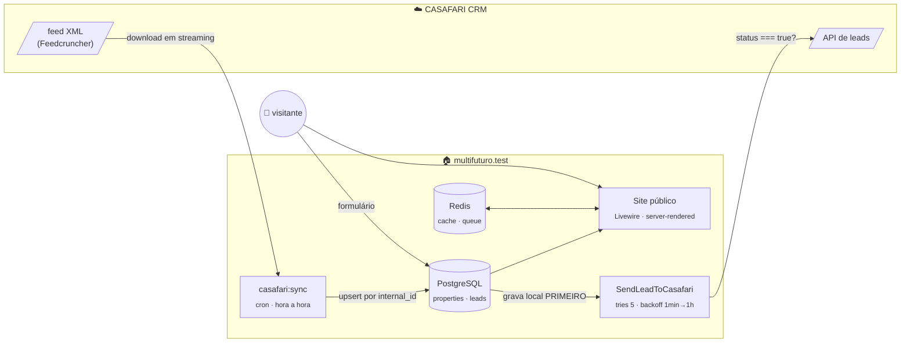

<div align="center">

# Multifuturo<span>.</span>

**Website da Multifuturo Imóveis Lda** — mediação imobiliária

*A carteira de imóveis do CASAFARI CRM, replicada localmente e servida com calma.*

[](https://github.com/Davide5fonseca/Multifuturo_Im-veis/actions/workflows/tests.yml)


<br><sub>a paleta: bege pastel como base, verde azeitona como acento · Fraunces + Inter, servidas localmente</sub>

<br>

[**📋 O que falta para ir online**](docs/CHECKLIST.md) · [**📜 Changelog por commit**](CHANGELOG.md) · [🐛 Issues](https://github.com/Davide5fonseca/Multifuturo_Im-veis/issues)

</div>

---

## 🧭 Arquitetura

> **Princípio inegociável:** o site **nunca** fala com o CRM em runtime para leitura.
> Réplica local sincronizada por cron; o CRM só é contactado para escrita (leads), sempre via queue.



| Decisão | Porquê |
|---|---|
| Réplica local, nunca leitura em runtime | o site sobrevive a qualquer indisponibilidade do CRM |
| Lead gravada localmente **antes** do envio | CRM em baixo ⇒ contacto não se perde; job em retry |
| Server-rendered, sem SPA | SEO — cada listagem, ficha e zona é indexável |
| Cache Redis com tag, invalidada pelo sync | páginas rápidas sem servir dados obsoletos |

## 🚀 Começar

> [!IMPORTANT]
> **Máquina nova:** copie o `.env.example` para `.env` **antes** do `composer install`.
> O `package:discover` arranca a aplicação e, sem `APP_ENV`, ela assume produção e
> **recusa arrancar sem `AGENCY_AMI`** — é intencional (Lei n.º 15/2013).

Pré-requisito: Docker Desktop a correr. O `./vendor/bin/sail` só corre em
macOS/Linux/WSL2 — **no Windows** usa o wrapper `sail.ps1`:

```powershell
.\sail.ps1 up -d              # arranca app + PostgreSQL + Redis + Mailpit
.\sail.ps1 artisan migrate    # cria as tabelas
npm install; npm run build    # assets
```

Abrir **http://localhost/** ✅

<details>
<summary><b>Portas, domínio local e atalhos do wrapper</b></summary>

<br>

| Serviço | Porta no host |
|---|---|
| Aplicação | `80` |
| Vite (HMR) | `5173` |
| PostgreSQL | `54320` † |
| Redis | `63790` † |
| Mailpit (email de teste) | `8025` (UI) |

† 5432/6379 estavam ocupadas por outros serviços nesta máquina.

**`http://multifuturo.test/`** requer uma linha no `hosts` (terminal Administrador):

```
127.0.0.1   multifuturo.test
```

**Atalhos do `sail.ps1`:** `artisan` · `composer` · `npm` · `pest` · `pint` · `tinker` ·
`shell` (bash no container) · `psql` · `redis` · `logs` · `ps`

</details>

## ⚙️ Configuração

Copiar `.env.example` → `.env` e preencher por grupo:

| Grupo | Variáveis | Config |
|---|---|---|
| 📥 CASAFARI · leitura | `CASAFARI_FEED_URL` · `CASAFARI_FEED_TIMEOUT/RETRIES/RETRY_DELAY_MS` · `CASAFARI_MIN_ITEMS` | `config/casafari.php` |
| 📤 CASAFARI · leads | `CASAFARI_LEAD_URL` · `CASAFARI_TOKEN` · `CASAFARI_CUSTOMER_ORIGIN_ID` · `CASAFARI_LEAD_ENTITY_TYPE` | `config/casafari.php` |
| 🔔 Alertas | `CASAFARI_ALERT_EMAIL` — falhas do sync e leads não entregues | `config/casafari.php` |
| 🏢 Agência | `AGENCY_NAME` · **`AGENCY_AMI`** · `AGENCY_PHONE/EMAIL/ADDRESS` · redes sociais · `AGENCY_COMPLAINTS_BOOK_URL` · `AGENCY_PRIVACY_POLICY_VERSION` · `AGENCY_HERO_IMAGE` | `config/agency.php` |
| 🍪 Cookies | `CONSENT_COOKIE` · `CONSENT_DAYS` · `CONSENT_VERSION` | `config/consent.php` |

> [!WARNING]
> Três regras que não são óbvias:
> - **`AGENCY_AMI`** é obrigatório por lei na comunicação comercial de mediação — em produção a app não arranca sem ele.
> - O domínio **nunca** é hardcoded: canonical, sitemap, OG e emails derivam de `APP_URL`.
> - Ao alterar o texto da política de privacidade, atualizar `AGENCY_PRIVACY_POLICY_VERSION` — cada lead guarda a versão que lhe foi apresentada.

## 🔄 Sincronização com o CASAFARI

```powershell
.\sail.ps1 artisan casafari:inspect        # Passo 0 — descreve o feed: hierarquia, contagem, lang
.\sail.ps1 artisan casafari:sync           # descarrega e sincroniza
.\sail.ps1 artisan casafari:sync --dry-run # só conta, não escreve
.\sail.ps1 artisan casafari:sync --force   # ignora o hash, reescreve tudo
.\sail.ps1 artisan schedule:work           # agendamento em local (hourlyAt 7)
```

O motor vive em `app/Services/Casafari/` e segue estas regras:

|  | Regra |
|---|---|
| 🔑 | **Upsert por `internal_id`** — chave única do CRM; parsing em streaming (`XMLReader`) |
| #️⃣ | **sha256 por nó XML** — imóvel inalterado só toca em `synced_at` (nem o `updated_at` mexe) |
| 🔗 | **Slug estável** — `tipo-concelho-referência`, gerado uma vez, nunca recalculado |
| 🗄️ | **Nunca se apaga** — desaparecido do feed ⇒ `is_active=false` (ficha responde **410** com semelhantes); reaparece ⇒ reativa |
| 🛑 | **Guard crítico** — feed com 0 imóveis (ou < `CASAFARI_MIN_ITEMS`) aborta **antes** de desativar; erros de mapeamento também suspendem a desativação |
| 🔒 | **`Owner` nunca é lido** — removido do DOM antes de qualquer mapeamento |

> [!NOTE]
> A nomenclatura dos nós em `config/casafari.php` (blocos `feed`/`mapping`) é **provisória**
> até o `casafari:inspect` correr sobre o feed real — e só esse bloco mudará.
> Os ficheiros em `storage/app/casafari/` contêm dados reais (incluindo de proprietários) e estão fora do git.

## ✉️ Leads

**Fluxo:** formulário → `StoreLeadRequest` valida → **grava local primeiro** → job na queue.

- ⚠️ **Armadilha tratada:** a API devolve HTTP 200 mesmo em falha — só `json.status === true`
  é sucesso; caso contrário retry (backoff 1 min → 1 h) e, esgotado, `failed` + email. A lead nunca se perde.
- 🕵️ **Anti-spam sem CAPTCHA:** honeypot (aceite em silêncio, sem gravar) · timestamp
  assinado com a `APP_KEY` (rejeita < 3 s ou forjado) · rate limiting por IP (5/min, 20/h, chave = hash do IP).
- 🇪🇺 **RGPD:** dois consentimentos separados (`IncludeOptIn`/`IncludeMailing`), desmarcados,
  nunca forçados; `policy_version` e `ip_hash` (HMAC — nunca o IP) gravados em cada lead.
- 🧵 Requer worker: `php artisan queue:work` (em produção, como serviço).

## 🖼️ Frontend

```powershell
npm run dev      # Vite com HMR
npm run build    # produção → public/build (não versionado)
```

Tipografia **Fraunces + Inter** servida de `public/fonts/` (zero pedidos a CDNs).
Tokens de cor em `resources/css/app.css` (`@theme`) — **nunca** hex soltos nos componentes.
Referência de layout: template "Consultor Imobiliário (Elegante)" — estrutura e tom, não cópia.

| Rota | Conteúdo |
|---|---|
| `/` | hero · pesquisa · destaques · sobre · porquê · zonas · banda de contacto |
| `/comprar` · `/arrendar` | listagem Livewire, filtros na query string, 12/página, URLs partilháveis |
| `/imoveis/{slug}` | galeria + lightbox · JSON-LD `RealEstateListing` · mapa só com `gmap_visible` e a pedido · semelhantes · formulário pré-preenchido · inativo ⇒ **410** |
| `/zonas/…` | páginas por concelho/freguesia derivadas da carteira; editorial opcional (tabela `zones`) |
| `/favoritos` | localStorage, sem registo |
| `/quanto-vale-a-minha-casa` | lead magnet de avaliação |
| `/sitemap.xml` · `/robots.txt` | dinâmicos; sitemap só com ativos; robots bloqueia fora de produção |

Cache de leituras: `App\Support\PropertyCache` (tag `properties`, TTL 1 h), limpa pelo evento `PropertiesSynced`.

## 🛡️ Privacidade, RGPD e conformidade

| Garantia | Como |
|---|---|
| Dados do proprietário **nunca** persistidos | nó `Owner` removido do DOM antes do mapeamento; sem coluna; testes procuram fugas em todas as colunas |
| Coordenadas protegidas | `gmap_visible=false` ⇒ nem HTML nem JSON-LD as contêm (acessor devolve `null`) |
| Zero pedidos externos sem consentimento | fontes locais; mapa OSM só ao clicar; scripts de terceiros via `<x-consent-script>` (`type="text/plain"` até opt-in); teste garante que nenhuma página chama fora |
| Banner de cookies granular | necessários / análise / marketing; recusa com o mesmo peso visual; cookie first-party 180 dias; "Gerir cookies" no rodapé |
| Rodapé legal | AMI · Livro de Reclamações eletrónico · políticas |
| Feed tratado como não confiável | tipos forçados e limitados, escape nas views, `LIBXML_NONET` (sem XXE), URLs validados |

Textos legais em `lang/pt/legal.php` — **minutas**, carecem de revisão jurídica.

## ✅ Testes e CI

```powershell
.\sail.ps1 pest    # 104 testes · Pest 3 · PostgreSQL "testing"
.\sail.ps1 pint    # estilo (--test para só verificar)
```

- PostgreSQL obrigatório nos testes (o schema usa `jsonb` + GIN; SQLite não serve).
- CI: [`.github/workflows/tests.yml`](.github/workflows/tests.yml) — Pint + Pest com
  PostgreSQL 16 e Redis em cada push/PR; em falha, as linhas do log saem como annotations.
- Regras críticas cobertas: guard do feed vazio · Owner · slugs estáveis · `gmap_visible` ·
  lead local com CRM em baixo · `status=false` em HTTP 200 · AMI em produção · XSS/XXE · rate limiting.

<details>
<summary><h2>🗺️ Mapa do código</h2></summary>

```
app/
├── Console/Commands/     CasafariInspect (diagnóstico do feed) · CasafariSync (sincronização)
├── Enums/                BusinessType · LeadSource · LeadStatus
├── Events/               PropertiesSynced (fim do sync → invalida cache)
├── Http/
│   ├── Controllers/      Page · Property (ficha, JSON-LD, 410) · Zone · Favorites · Lead · Sitemap · Robots
│   └── Requests/         StoreLeadRequest (validação + anti-spam)
├── Jobs/                 SendLeadToCasafari (queue, retries, status===true)
├── Listeners/            FlushPropertyCache
├── Livewire/             PropertyListing (filtros na query string, paginação, cache)
├── Models/               Property (scopes, coordinates, generateSlug) · Lead · Zone
├── Notifications/        LeadDeliveryFailed
├── Services/Casafari/    FeedClient · FeedReader · PropertyMapper · PropertySyncer · SyncResult
└── Support/              AppUrl · AgencyCompliance (AMI) · Format · PropertyCache · Zones · helpers

config/    casafari.php (feed/mapping PROVISÓRIO) · agency.php · consent.php
lang/pt/   ui.php (toda a UI) · legal.php (políticas) · validation/pagination/auth/passwords
resources/
├── css/app.css           tokens da marca (@theme) · fontes locais
├── js/                   app.js (favoritos, fallback de imagens) · consent.js (cookies)
└── views/
    ├── components/       layouts/app · site/{header,footer,search-form,consent-banner}
    │                     property/{card,image,gallery} · lead-form · consent-script
    ├── livewire/         property-listing
    ├── pages/            home · listing · property · property-gone · zones · zone ·
    │                     favorites · contact · valuation · legal
    └── errors/           404 (com pesquisa) · 500 · 503
tests/
├── Feature/              AgencyConfig · PublicPages · SeoFiles · PropertySchema ·
│                         CasafariSync · Leads · Frontend · Legal · PropertyMapper · EdgeCases
└── Fixtures/             casafari-feed.xml (PROVISÓRIA — substituir por excerto real anonimizado)
```

</details>

---

<div align="center">
<sub>🏠 Multifuturo Imóveis Lda · pt-PT · Europe/Lisbon</sub>
</div>
